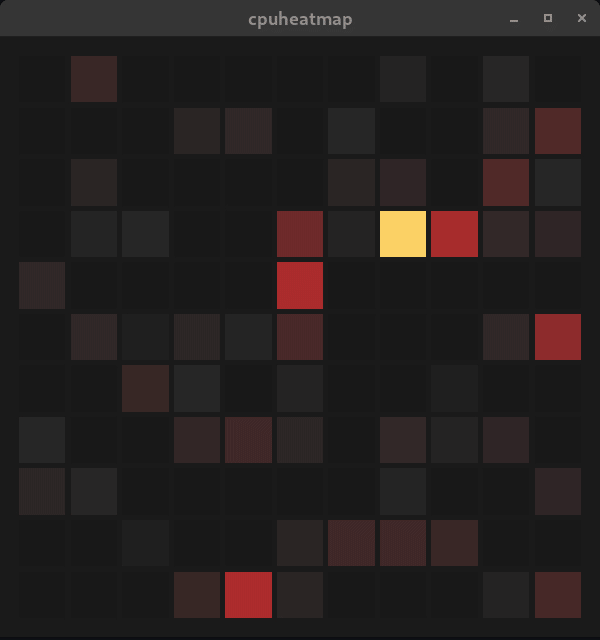

# cpuheatmap is a cpu load visualizer.

It allows for clear and immediate assessment of the distribution of
load across a large number of cores. It's also pretty to look at.

Example: AMD Threadripper Pro system with a total of 128 cores:

